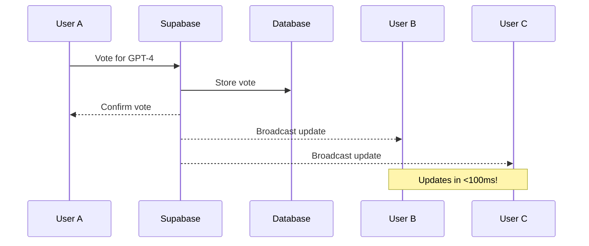

# 🚀 LLM Popularity Tracker - Real-Time Edition

**Vote for your favorite AI models with instant, real-time updates powered by Supabase WebSockets!**


## ✨ What's New?

This version uses **Supabase** for true real-time updates via WebSockets. When anyone votes, ALL users see it instantly - no polling, no delays!

### Before vs After

| Feature | Old System | New System |
|---------|------------|------------|
| **Real-time** | Polling every 5s | WebSocket (instant) |
| **Infrastructure** | Docker + PostgreSQL + Redis | Just Supabase |
| **Setup Time** | 30+ minutes | 5 minutes |
| **Monthly Cost** | $20-50 (VPS) | $0 (free tier) |
| **Maintenance** | You manage everything | Fully managed |
| **Scalability** | Manual scaling | Auto-scaling |

## 🎯 Features

- ⚡ **Instant Updates**: Vote changes appear in <100ms for all users
- 🌍 **Global Real-time**: Users worldwide see the same data instantly
- 📊 **Live Statistics**: Rankings and stats update in real-time
- 🔒 **Vote Security**: One vote per LLM per user (fingerprint-based)
- 📱 **Mobile Responsive**: Works perfectly on all devices
- 🚀 **Zero Config Deploy**: Push to GitHub, deploy to Vercel
- 💰 **Free for 10k Users**: No credit card required

## 🏃 Quick Start (5 Minutes!)

### 1️⃣ Clone & Install

```bash
git clone https://github.com/yourusername/llm-popularity-tracker.git
cd llm-popularity-tracker
npm install
```

### 2️⃣ Set Up Supabase (2 min)

1. Go to [app.supabase.com](https://app.supabase.com) and create a free account
2. Create a new project (remember your password!)
3. Once created, go to **SQL Editor** and run the contents of `supabase/schema.sql`
4. Go to **Settings → API** and copy your URL and anon key

### 3️⃣ Configure Environment (1 min)

Create `.env.local`:
```env
NEXT_PUBLIC_SUPABASE_URL=https://xxxxx.supabase.co
NEXT_PUBLIC_SUPABASE_ANON_KEY=eyJ...your-key
```

### 4️⃣ Start Development

```bash
npm run dev
```

Open [http://localhost:3000](http://localhost:3000) and see the magic! ✨

## 🌐 Deploy to Production (2 Minutes!)

### Deploy to Vercel (Recommended)

1. Push to GitHub:
```bash
git push origin main
```

2. Go to [vercel.com](https://vercel.com) → Import GitHub repo
3. Add environment variables (same as `.env.local`)
4. Click Deploy!

Your app is now live at `https://your-app.vercel.app` 🎉

## 🏗️ Architecture

```
┌─────────────────────────────────────┐
│         User Browser                 │
│   (React + Supabase Client)         │
└─────────────┬───────────────────────┘
              │ WebSocket
              ▼
┌─────────────────────────────────────┐
│         Supabase Cloud              │
│  • PostgreSQL Database              │
│  • Realtime Server (WebSockets)     │
│  • Auto-generated REST APIs         │
│  • Row Level Security               │
└─────────────────────────────────────┘
              ▲
              │ Static Files
              ▼
┌─────────────────────────────────────┐
│         Vercel Edge Network         │
│  • Global CDN                       │
│  • Serverless Functions             │
│  • Auto-scaling                     │
└─────────────────────────────────────┘
```

## 📊 Capacity & Limits

### Free Tier Handles:
- ✅ **10,000 monthly users**
- ✅ **200 concurrent WebSocket connections**
- ✅ **500MB database storage** (millions of votes)
- ✅ **2GB bandwidth**
- ✅ **Unlimited API requests** (within reason)

### When You Hit 10k+ Users:
- Supabase Pro: $25/month (unlimited connections)
- Vercel Pro: $20/month (more bandwidth)
- Still 95% cheaper than traditional hosting!

## 🔄 Real-Time Flow



## 🛠️ Development

### Project Structure
```
llm-popularity-tracker/
├── app/                    # Next.js app directory
│   ├── page.js            # Main voting interface
│   └── api/               # API routes (health check only)
├── components/            # React components
├── store/                 # Zustand state management
│   └── useVoteStore.js    # Main store with Supabase
├── lib/
│   ├── supabase/         # Supabase client & logic
│   ├── fingerprint.js    # User fingerprinting
│   └── llm-data.js       # LLM definitions
├── supabase/
│   └── schema.sql        # Database schema
└── public/               # Static assets
```

### Available Scripts

```bash
npm run dev          # Start development server
npm run build        # Build for production
npm start            # Start production server
npm run lint         # Run ESLint
```

## 🔍 Monitoring

### Supabase Dashboard
- Real-time connection monitor
- Database metrics
- Query performance
- Error logs

### Vercel Dashboard
- Deployment status
- Function logs
- Analytics
- Performance metrics

## 🐛 Troubleshooting

| Issue | Solution |
|-------|----------|
| "Failed to connect" | Check Supabase credentials in `.env.local` |
| No real-time updates | Ensure WebSocket port isn't blocked |
| Votes not persisting | Check Supabase dashboard for errors |
| Slow initial load | Normal - Vercel cold start (~2s) |

## 🤝 Contributing

1. Fork the repo
2. Create feature branch: `git checkout -b feature/amazing`
3. Commit: `git commit -m 'Add amazing feature'`
4. Push: `git push origin feature/amazing`
5. Open Pull Request

## 📝 Environment Variables

| Variable | Description | Required |
|----------|-------------|----------|
| `NEXT_PUBLIC_SUPABASE_URL` | Your Supabase project URL | ✅ |
| `NEXT_PUBLIC_SUPABASE_ANON_KEY` | Your Supabase anon key | ✅ |
| `NODE_ENV` | Environment (development/production) | ❌ |

## 🎯 Why This Architecture?

### vs Traditional Backend
- **No servers to manage**: Everything is managed cloud services
- **Instant global deployment**: Push to git, deployed worldwide
- **Auto-scaling**: Handles traffic spikes automatically
- **99.99% uptime**: Enterprise-grade infrastructure

### vs Polling
- **True real-time**: WebSockets vs polling every X seconds
- **Lower bandwidth**: Only sends changes, not entire state
- **Better UX**: Instant feedback, no delays
- **Less server load**: Persistent connections vs constant requests

## 📚 Tech Stack Details

- **[Next.js 15](https://nextjs.org)**: React framework with app router
- **[Supabase](https://supabase.com)**: Open-source Firebase alternative
- **[Vercel](https://vercel.com)**: Deployment and hosting
- **[Zustand](https://zustand-demo.pmnd.rs)**: State management
- **[Tailwind CSS](https://tailwindcss.com)**: Styling
- **[Framer Motion](https://www.framer.com/motion)**: Animations

## 📄 License

MIT - Use this for whatever you want!

## 🙏 Acknowledgments

- Supabase team for the amazing real-time infrastructure
- Vercel for the free hosting
- The AI community for inspiration

---

**Built with ❤️ for the AI Community**

*Star ⭐ this repo if you find it useful!*